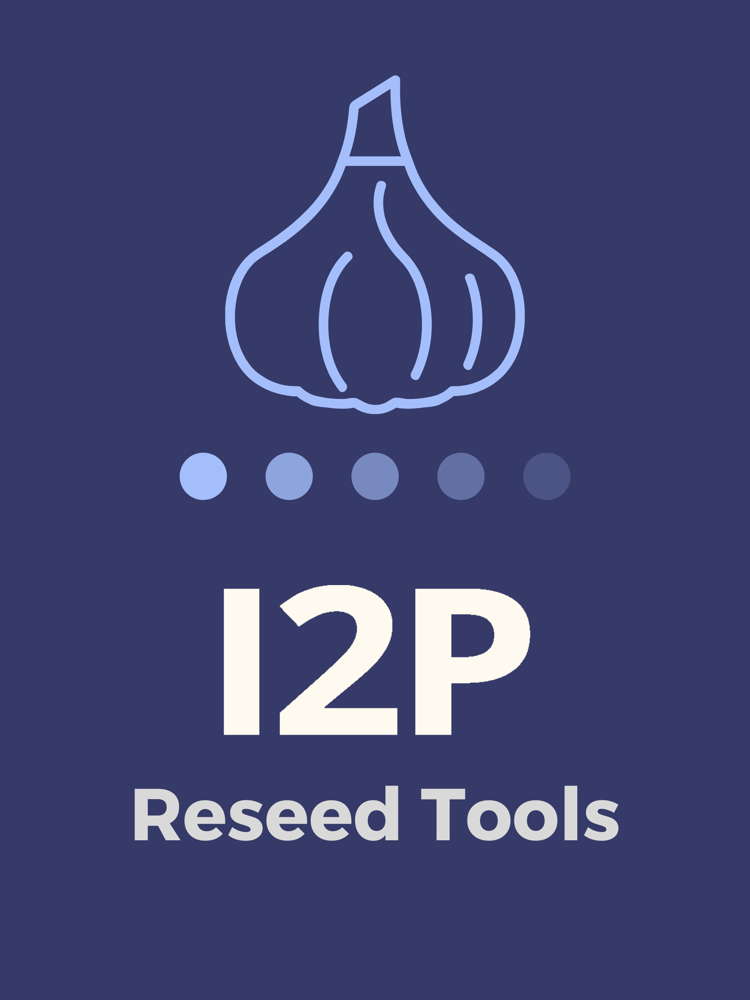

I2P Reseed Tools
==================



This tool provides a secure and efficient reseed server for the I2P network.
There are several utility commands to create, sign, and validate SU3 files.
Please note that this requires at least Go version 1.13, and uses Go Modules.

Standard reseeds are distributed with the I2P packages. To get your reseed
included, apply on [zzz.i2p](http://zzz.i2p).

## Dependencies

`go`, `git`, and optionally `make` are required to build the project.
Precompiled binaries for most platforms are available at my github mirror
https://github.com/eyedeekay/i2p-tools-1.

In order to install the build-dependencies on Ubuntu or Debian, you may use:

```sh
sudo apt-get install golang-go git make
```

## Installation

Reseed-tools can be run as a user, as a freestanding service, or be installed
as an I2P Plugin. It will attempt to configure itself automatically. You should
make sure to set the `--signer` flag or the `RESEED_EMAIL` environment variable
to configure your signing keys/contact info.

#### Plugin install URL's

Plugin releases are available inside of i2p at http://idk.i2p/reseed-tools/
and via the github mirror at https://github.com/eyedeekay/reseed-tools/releases.
These can be installed by adding them on the 
[http://127.0.0.1:7657/configplugins](http://127.0.0.1:7657/configplugins).

After installing the plugin, you should immediately edit the `$PLUGIN/signer`
file in order to set your `--signer` email, which is used to name your keys.
You can find the `$PLUGIN` directory in your I2P config directory, which is
usually `$HOME/.i2p` on Unixes.

This will allow the developers to contact you if your reseed has issues
and will authenticate your reseed to the I2P routers that use it.

- darwin/amd64: [http://idk.i2p/reseed-tools/reseed-tools-darwin-amd64.su3](http://idk.i2p/reseed-tools/reseed-tools-darwin-amd64.su3)
- darwin/arm64: [http://idk.i2p/reseed-tools/reseed-tools-darwin-arm64.su3](http://idk.i2p/reseed-tools/reseed-tools-darwin-arm64.su3)
- linux/386: [http://idk.i2p/reseed-tools/reseed-tools-linux-386.su3](http://idk.i2p/reseed-tools/reseed-tools-linux-386.su3)
- linux/amd64: [http://idk.i2p/reseed-tools/reseed-tools-linux-amd64.su3](http://idk.i2p/reseed-tools/reseed-tools-linux-amd64.su3)
- linux/arm: [http://idk.i2p/reseed-tools/reseed-tools-linux-arm.su3](http://idk.i2p/reseed-tools/reseed-tools-linux-arm.su3)
- linux/arm64: [http://idk.i2p/reseed-tools/reseed-tools-linux-arm64.su3](http://idk.i2p/reseed-tools/reseed-tools-linux-arm64.su3)
- openbsd/amd64: [http://idk.i2p/reseed-tools/reseed-tools-openbsd-amd64.su3](http://idk.i2p/reseed-tools/reseed-tools-openbsd-amd64.su3)
- freebsd/386: [http://idk.i2p/reseed-tools/reseed-tools-freebsd-386.su3](http://idk.i2p/reseed-tools/reseed-tools-freebsd-386.su3)
- freebsd/amd64: [http://idk.i2p/reseed-tools/reseed-tools-freebsd-amd64.su3](http://idk.i2p/reseed-tools/reseed-tools-freebsd-amd64.su3)
- windows/amd64: [http://idk.i2p/reseed-tools/reseed-tools-windows-amd64.su3](http://idk.i2p/reseed-tools/reseed-tools-windows-amd64.su3)
- windows/386: [http://idk.i2p/reseed-tools/reseed-tools-windows-386.su3](http://idk.i2p/reseed-tools/reseed-tools-windows-386.su3)

### Installation(From Source)

```
git clone https://i2pgit.org/idk/reseed-tools
cd reseed-tools
make build
# Optionally, if you want to install to /usr/bin/reseed-tools
sudo make install
```

## Usage

#### Debian/Ubuntu note:

Debian users who are running I2P as a system service must also run the 
`reseed-tools` as the same user. This is so that the reseed-tools can access
the I2P service's netDb directory. On Debian and Ubuntu, that user is `i2psvc`
and the netDb directory is: `/var/lib/i2p/i2p-config/netDb`.

##### Service Integration

Support for running as a system service as part of the reseed package
is new. PR's that improve integration are welcome.

###### Systemd Service

A systemd service is provided which should work with the I2P Debian package
when reseed-tools is installed in `/usr/bin/reseed-tools`. If you install with
`make install` this service is also installed. This service will cause the
bundles to regenerate every 12 hours.

The contact email for your reseed should be added in:
`/etc/systemd/system/reseed.d/reseed.conf`.

Self-signed certificates will be auto-generated for these services. To change
this you should edit the `/etc/systemd/system/reseed.d/reseed.service`.

- To enable starting the reseed service automatically with the system: `sudo systemctl enable reseed.service`
- To run the service manually: `sudo sysctl start reseed.service`  
- To reload the systemd services: `sudo systemctl daemon-reload`
- To view the status/logs: `sudo journalctl -u reseed.service`

###### SysV Service

An initscript is also provided. The initscript, unlike the systemd service,
cannot schedule itself to restart. You should restart the service roughly once
a day to ensure that the information does not expire.

The contact email for your reseed should be added in:
`/etc/init.d/reseed`.

Self-signed certificates will be auto-generated for these services. To change
this you should edit the `/etc/init.d/reseed`.

## Example Commands:

### Without a webserver, standalone with TLS support

If this is your first time running a reseed server (ie. you don't have any existing keys),
you can simply run the command and follow the prompts to create the appropriate keys, crl and certificates.
Afterwards an HTTPS reseed server will start on the default port and generate 6 files in your current directory
(a TLS key, certificate and crl, and a su3-file signing key, certificate and crl).

```
reseed-tools reseed --signer=you@mail.i2p --netdb=/home/i2p/.i2p/netDb --tlsHost=your-domain.tld
```

### Locally behind a webserver (reverse proxy setup), preferred:

If you are using a reverse proxy server it may provide the TLS certificate instead.

```
reseed-tools reseed --signer=you@mail.i2p --netdb=/home/i2p/.i2p/netDb --port=8443 --ip=127.0.0.1 --trustProxy
```

- **Usage** [More examples can be found here.](EXAMPLES.md)
- **Docker** [Docker examples can be found here](DOCKER.md)
